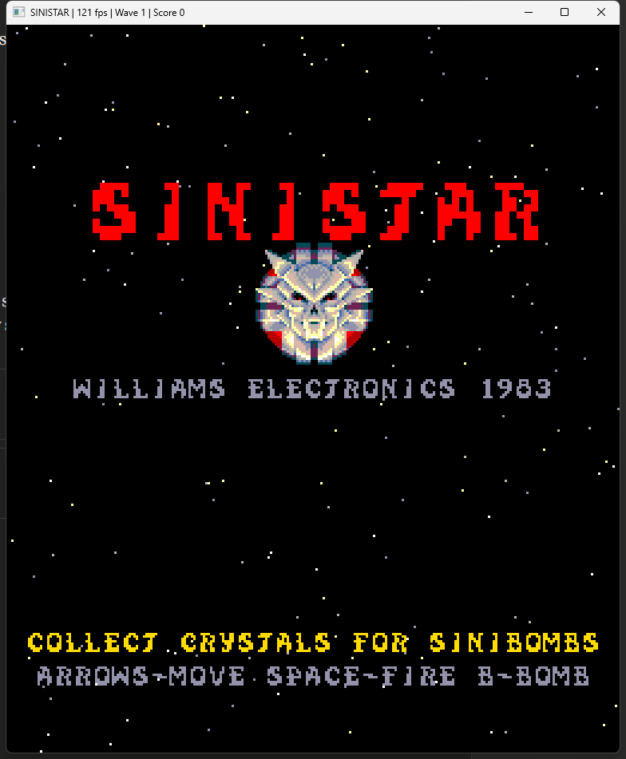
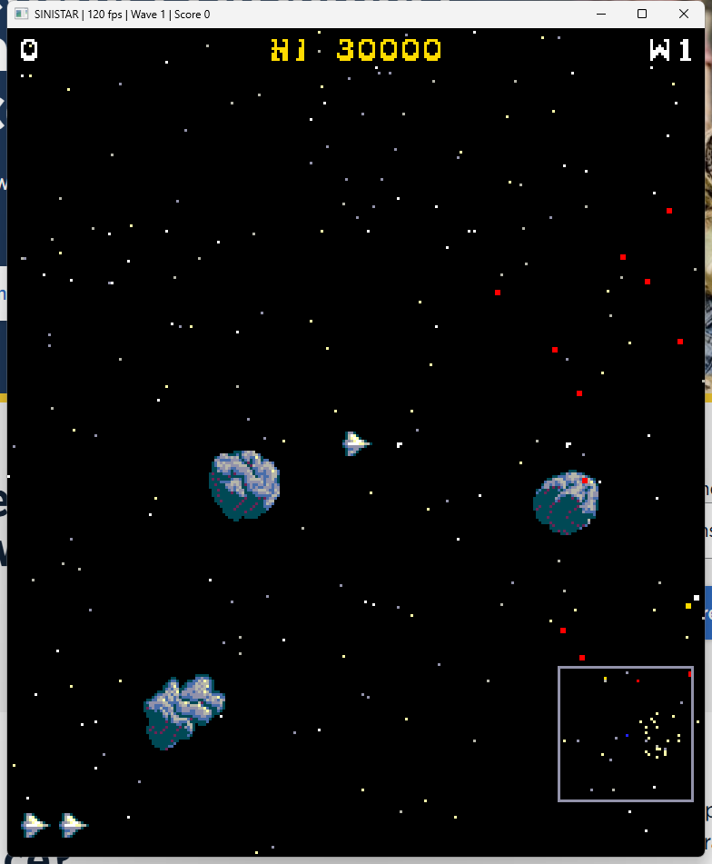
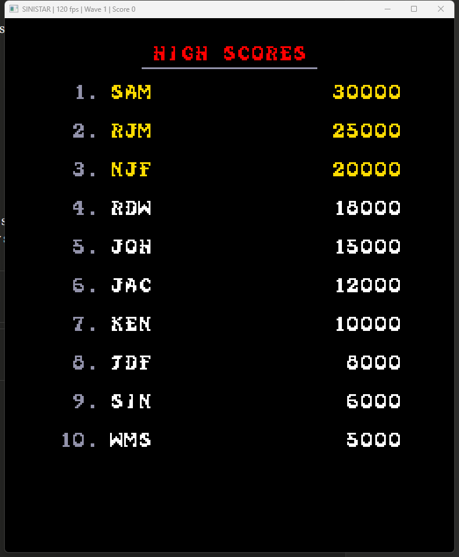
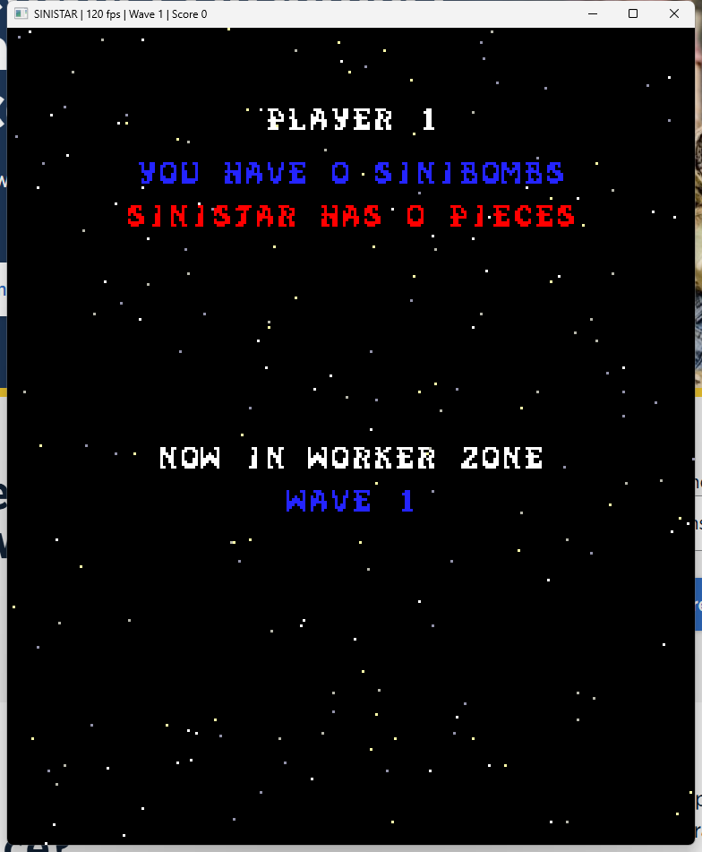
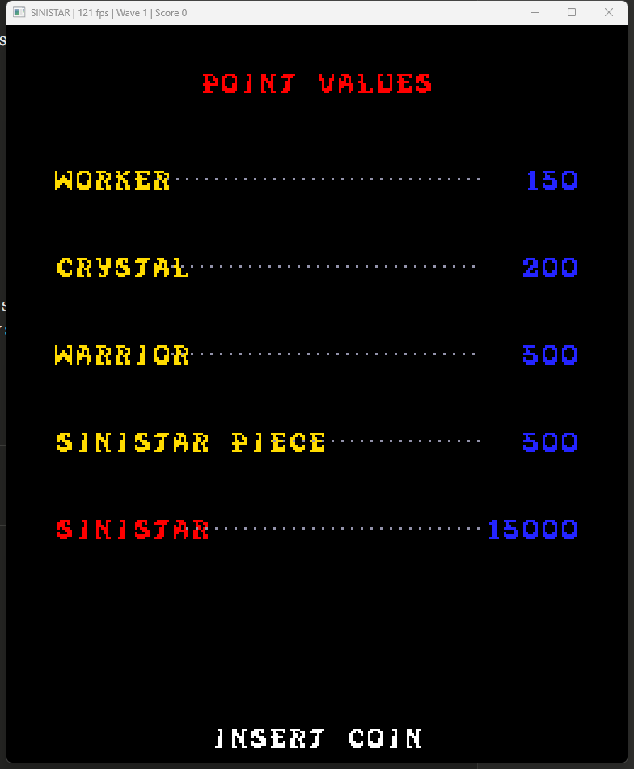
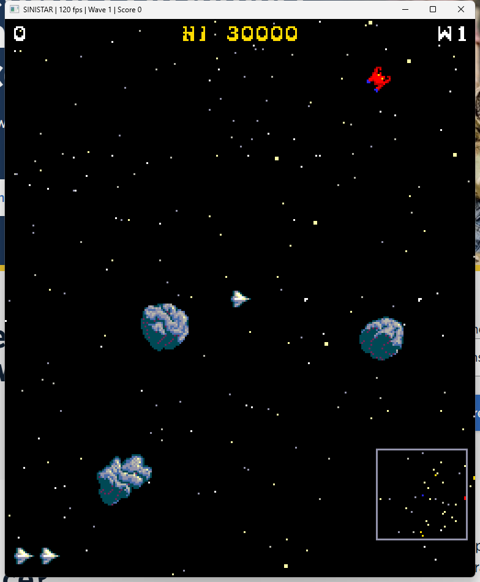

# Sinistar

Native C++/SDL2 reimplementation of **Sinistar** (Williams Electronics, 1983). This is not an emulator — it is a from-scratch rewrite that faithfully recreates the original arcade experience. All sprites, speech, and game parameters are loaded at runtime from editable files.



## Screenshots

| Title Screen | Gameplay | High Scores |
|:---:|:---:|:---:|
|  |  |  |

| Status Screen | Points Reference | Gameplay (Combat) |
|:---:|:---:|:---:|
|  |  |  |

## Features

- **Authentic sprite rendering** from original ROM-extracted PNG sprite sheets (32-frame player rotation, 16-frame workers, piece-by-piece Sinistar face assembly)
- **Digitized speech** — all 8 original phrases ("Beware, I live!", "Run, coward!", etc.) from the Harris HC-55516 CVSD codec
- **Original 16-color Williams palette** (BBGGGRRR hardware format)
- **ROM-accurate Sinistar AI** with velocity-table-driven chase/orbit modes and the original 12-tick inhibitor spiral
- **ROM-accurate build thresholds** ($4FAA) — Sinistar assembly requires multiple crystal deliveries per piece, scaling with difficulty
- **Complete game state machine** — attract mode (title/high scores/points), status screen, gameplay, death sequence, game over, high score entry, Sinistar explosion
- **4-zone difficulty cycle** — Worker, Warrior, Planetoid, Void zones that repeat with escalating difficulty
- **Free life system** — extra lives at 20,000 then every 25,000 points
- **Externalized game configuration** — all balance parameters in human-editable text files for easy tuning
- **Gamepad support** via SDL2 GameController API

## Requirements

- **C++17 compiler** (g++, clang++, or MSVC)
- **SDL2** development libraries
- **CMake** 3.16+ (or Make on Linux)

### Installing SDL2

```bash
# Debian/Ubuntu
sudo apt install libsdl2-dev

# Fedora
sudo dnf install SDL2-devel

# Arch
sudo pacman -S sdl2

# Windows (vcpkg)
vcpkg install sdl2

# Windows (MSYS2 MinGW)
pacman -S mingw-w64-x86_64-SDL2
```

## Building

### Linux (Make)

```bash
make
```

### Linux / Windows / macOS (CMake)

```bash
cmake -B build
cmake --build build
```

If using vcpkg on Windows, pass the toolchain file:

```bash
cmake -B build -DCMAKE_TOOLCHAIN_FILE=[vcpkg-root]/scripts/buildsystems/vcpkg.cmake
cmake --build build --config Release
```

The executable is placed in the project root directory.

## Running

```bash
./sinistar
```

To specify a different assets directory:

```bash
./sinistar -assets /path/to/assets
```

## Controls

| Key | Action |
|-----|--------|
| Arrow keys / WASD | Move |
| Space | Fire bullets |
| B | Launch Sinibomb (homing) |
| 5 | Insert coin |
| 1 | Start game |
| Escape | Quit |

**Gamepad**: Left stick/D-pad to move, A/Right trigger to fire, B/Left trigger for Sinibomb, Start to start, Back to insert coin.

## How to Play

1. **Insert a coin** (press 5) and **start** (press 1)
2. **Mine crystals** by shooting planetoids — crystals pop out after sustained fire
3. **Collect crystals** to build Sinibombs (your only weapon against Sinistar)
4. **Destroy Sinistar** with Sinibombs before it's fully assembled and hunts you down
5. Workers are building Sinistar while you mine — it's a race against time
6. Completing a zone warps you to the next, harder zone

**Tip**: In the early Worker Zone, warriors are mostly passive. Use this time to stockpile Sinibombs before entering more dangerous zones.

## Project Structure

```
sinistar/
  src/
    main.cpp            # SDL2 window, rendering, input, audio
    game.h              # Game state machine, entity simulation, AI, collisions
    config.h            # Configuration structs and INI-style parser
    assets.h            # Sprite/speech/palette loading from PNG/WAV files
    williams.h          # Original Williams hardware definitions (reference)
  assets/
    sprites/            # PNG sprite sheets + .meta frame descriptors
    speech/             # 8 digitized WAV speech phrases
    config/
      game.cfg          # Scoring, physics, AI, timing parameters
      zones.cfg         # Zone definitions, Sinistar velocity tables
  docs/
    rom_analysis.md     # Detailed ROM reverse-engineering documentation
    screenshots/        # Game screenshots
  tools/
    extract_assets.cpp  # One-time ROM-to-PNG asset extractor
```

## Configuration

All game balance parameters are externalized to human-editable config files in `assets/config/`. The game uses built-in defaults if these files are missing.

### game.cfg

INI-style configuration with sections:

```ini
[points]
worker = 150          # Points for destroying a worker
crystal = 200         # Points for collecting a crystal
warrior = 500         # Points for destroying a warrior
sinistar = 15000      # Points for destroying Sinistar

[player]
thrust = 800          # Player acceleration force
max_speed = 250       # Maximum player velocity
fire_cooldown = 0.12  # Seconds between shots
bullet_speed = 500    # Player bullet velocity

[warrior]
aggro_dist_base = 60  # Base detection range (pixels)
fire_cd_base = 5.0    # Base time between warrior shots (seconds)
bullet_speed = 300    # Warrior bullet velocity

[difficulty]
scale_per_cycle = 0.08   # Speed multiplier increase per zone cycle
aggr_per_cycle = 0.05    # Aggression increase per zone cycle
max_warriors = 15        # Hard cap on warrior count
```

### zones.cfg

Zone definitions and Sinistar velocity tables:

```ini
[zones]
# name       plan war wkr crys warSpd wkrSpd siniSpd startPcs aggr
WORKER         20   2   5   15     80     60     150        0  0.05
WARRIOR        20   5   8   12    100     80     200        3  0.20
PLANETOID      18   4   7   10    110     90     230        5  0.15
VOID           12   7  10    8    130    100     270        7  0.40

[chase_table]
# distThreshold  maxSpeed  shift
4096  480  5
2048  280  5
 ...

[orbit_table]
# distThreshold  maxSpeed  shift (Sinistar spiral approach)
4096  800  5
2048  500  5
 ...
```

## Assets

The game loads all sprites and speech from the `assets/` directory at runtime:

```
assets/
  sprites/
    player.png + .meta         # 32-frame rotation sprite sheet
    worker.png + .meta         # 16-frame worker rotation
    warrior.png + .meta        # Warrior sprite
    planetoid.png + .meta      # 5 planetoid types
    sinibomb.png + .meta       # 3-frame sinibomb animation
    shots.png + .meta          # 16-frame bullet sprites
    crystal.png + .meta        # Crystal collectible
    sinistar_face.png + .meta  # Complete Sinistar face
    sinistar_pieces.png + .meta # 11 unique face pieces for incremental build
    palette.txt                # 16-color Williams arcade palette
  speech/
    bewareil.wav               # "Beware, I live!"
    ihunger.wav                # "I hunger"
    iamsinis.wav               # "I am Sinistar"
    runcowar.wav               # "Run, coward!"
    bewareco.wav               # "Beware, coward!"
    ihungerc.wav               # "I hunger, coward!"
    runrunru.wav               # "Run! Run! Run!"
    aargh.wav                  # Roar/growl (Sinistar destroyed)
```

### Editing Sprites

Sprite sheets are standard PNG files — open them in any image editor. Each sheet is a horizontal strip of frames using the 16-color Williams arcade palette (see `palette.txt`). Transparent pixels (alpha=0) are not drawn. The `.meta` file alongside each PNG defines frame count, cell size, and per-frame dimensions/center offsets.

### Extracting Assets from ROMs

If you have the original Sinistar ROM files, you can regenerate the assets:

```bash
# Place ROMs in source/ directory, then:
cmake --build build --target extract_assets --config Release
./extract_assets

# Or with Make on Linux:
make extract
```

## Technical Details

### Architecture

The game is implemented as a single-file game engine (`game.h`) with a separate renderer (`main.cpp`). The `Game` struct contains the complete game state including all entities, scores, and state machine. The renderer reads game state and draws to an off-screen framebuffer that maps to the original 256x304 portrait display.

### Sinistar Face Assembly

The most complex visual system — Sinistar's face is built from 11 unique pieces (plus 9 mirrored copies = 20 draw operations), assembled incrementally as workers deliver crystals. Build thresholds from the original ROM ($4FAA: `01 02 03 04 05 09 0D 0F`) gate how many deliveries are needed per piece at each difficulty level.

### Sinistar AI

When fully assembled, Sinistar hunts the player using a two-phase approach:
1. **Inhibitor phase** (12 ticks): Spiral orbit approach using the orbit velocity table
2. **Direct chase**: Aggressive pursuit using the chase velocity table

Both phases use distance-threshold lookup tables where each entry maps a distance range to a maximum speed and acceleration shift factor. The difficulty multiplier scales all velocities.

### Difficulty System

The game cycles through 4 zones (Worker → Warrior → Planetoid → Void), then repeats with increased difficulty:
- **Speed multiplier** increases by `scale_per_cycle` each full cycle
- **Aggression** (warrior chase probability, detection range, fire rate) increases by `aggr_per_cycle`
- **Build thresholds** require more crystal deliveries per Sinistar piece at higher difficulty levels
- Entity counts and speeds per zone are independently configurable

### ROM Analysis

See [docs/rom_analysis.md](docs/rom_analysis.md) for comprehensive reverse-engineering documentation of the original arcade ROMs, including memory maps, sprite formats, the face compositing system, AI velocity tables, and a detailed comparison between the original and this reimplementation.

## About

**Sinistar** was designed by Sam Dicker, RJ Mical, Noah Falstein, Richard Witt, and Jack Haeger at Williams Electronics in 1982-1983. It was one of the first arcade games to feature digitized speech and remains a defining title of the golden age of arcade games. The menacing cry of "Beware, I live!" is one of the most iconic moments in gaming history.

This project is a fan reimplementation for educational and preservation purposes.
